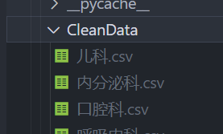
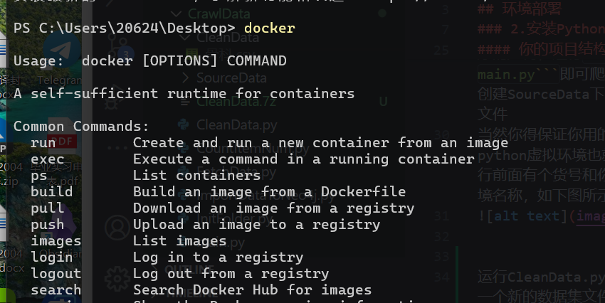
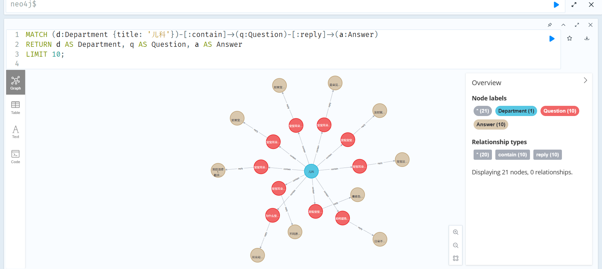

# 本项目是基于知识图谱的医疗领域问答系统

## 环境部署

### 1. 首先使用git clone将项目下载到你的本地

### 2.安装Python虚拟运行环境
按照 Python 虚拟环境可以帮助你在项目之间隔离依赖，并确保每个项目都可以使用特定版本的包。同时，使用 requirements.txt 文件可以让你快速部署相同的环境到其他地方。以下是按照 Python 虚拟环境并使用 requirements.txt 快速部署环境的一般步骤：

#### a. 步骤一：创建虚拟环境
打开命令行终端。
切换到你项目的目录中。
运行以下命令创建一个名为 myenv 的虚拟环境（你也可以用其他名字）：
```python -m venv myenv```
#### b. 步骤二：激活虚拟环境
在 Windows 中，激活虚拟环境的命令是：
```myenv\Scripts\activate```

#### d. 步骤三：安装依赖
激活虚拟环境后，你可以安装项目所需的依赖包。一种方法是使用 pip install 命令逐个安装所需的包。但更常见的是，使用 requirements.txt (使用```pip freeze >> requirements.txt```生成，其中是该Python需要的库)文件来一次性安装所有依赖：

```pip install -r requirements.txt```
这会读取 requirements.txt 文件中列出的所有包，并安装它们到当前的虚拟环境中。

#### 你的项目结构看起来应该如此

SourceData下面是数据集，可以直接脱进去，也可以自己跑跑爬虫脚本

CrawData下的main.py是程序的如何，运行```python main.py```即可爬取数据并创建SourceData下的数据集文件
当然你得保证你用的是python虚拟环境也就是命令行前面有个货号和你的虚拟环境名称，如下图所示


运行CleanData.py将会生成一个新的数据集文件CleanData这个里面包含清洗过的数据集


ImportDataToNeo4j.py是导入数据库的脚本里面连接数据库的密码和用户根据自己设置的修改
*****
## 关于Neo4j的安装
推荐使用Docker来安装，去Docker下载对应合适的版本之后打开电脑命令行输入```docker```
出现下面的信息就说明安装成功

之后在终端输入
```
docker run -d --name neo4j -p 7474:7474 -p 7687:7687 -v E:\DockerSoftWares\neo4j\data:/data -v E:\DockerSoftWares\neo4j\logs:/logs -v E:\DockerSoftWares\neo4j\conf:/var/lib/neo4j/conf -v E:\DockerSoftWares\neo4j\import:/var/lib/neo4j/import --env NEO4J_AUTH=neo4j/password neo4j
```
其中宿主机和Docker容器对应文件路径可以改成自己的
在Docker的container里面就可以看到Neo4j了

启动Neo4j容器之后在浏览器输入
```http://localhost:7474/browser/```
就可以跳转到Neo4j的Web管理界面

运行导入数据脚本之后，在终端中输入Cypher命令
```
MATCH (d:Department {title: '儿科'})-[:contain]->(q:Question)-[:reply]->(a:Answer)
RETURN d AS Department, q AS Question, a AS Answer
LIMIT 10;
```
之后就可以看到图谱查询结果
